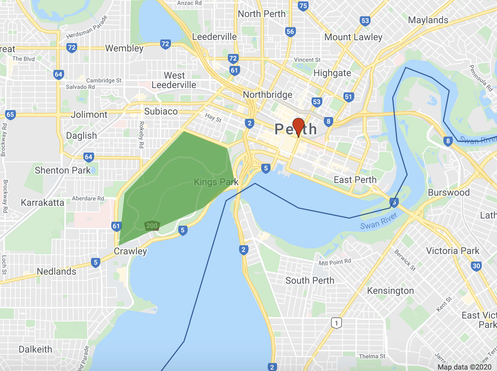
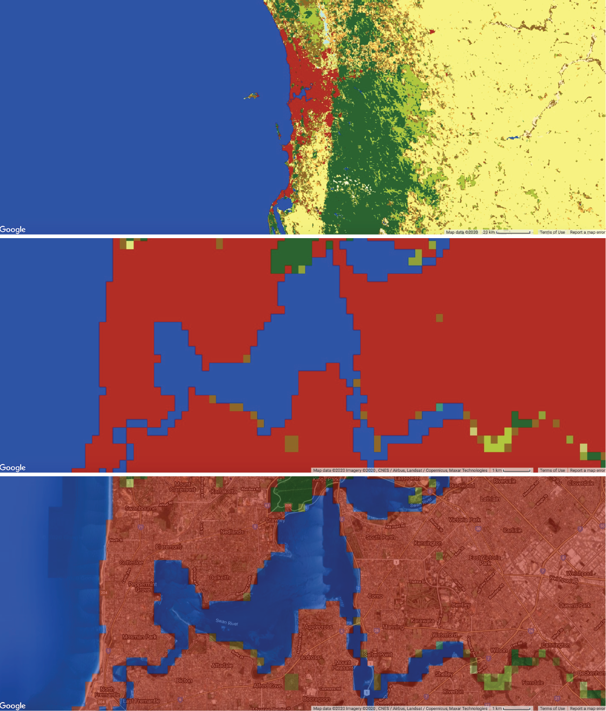
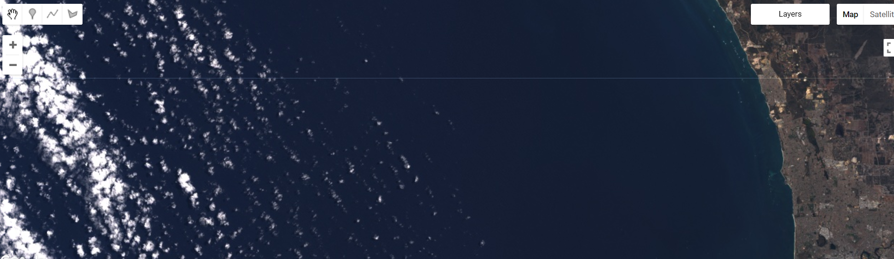
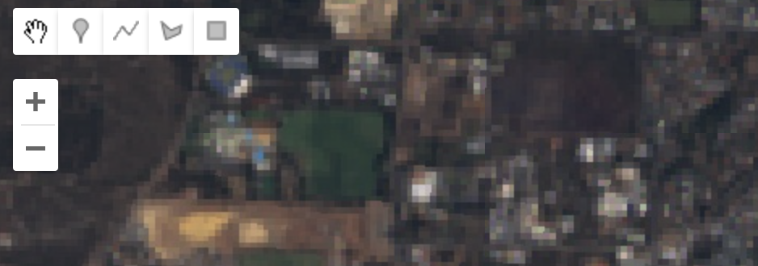
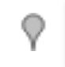
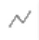
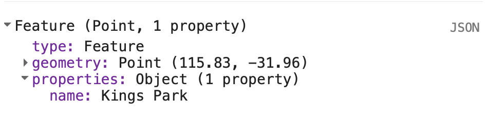
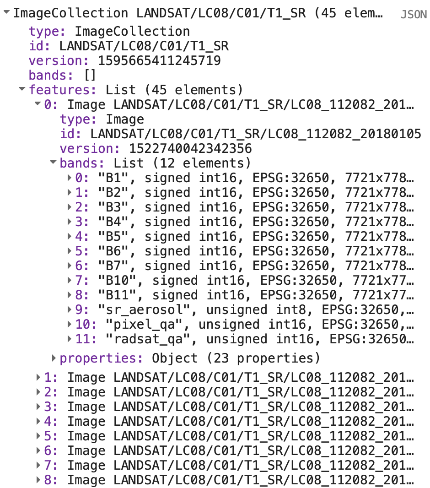

# Spatial data in Google Earth Engine

## Introduction

This lab introduces spatial data models for representing geographic entities in Google Earth Engine. 

### Setup

Create a new script in your *labs-gee/lab-5* repository called *spatial-data-in-gee.js*. Enter the following comment header to the script. 


```js
/*
Spatial data in GEE
Author: Test
Date: XX-XX-XXXX

*/

```

## Client and Server

In the JavaScript intro lab you wrote programs that are executed in your browser and run on the hardware in your local machine (i.e. any data in variables you declare resides in your computer's memory and the functions you call run on your computer's CPU). 

However, your machine has limited storage, memory, and processing power. Google Earth Engine allows you to access cloud servers comprising more powerful computers and access to larger datasets. You still write a Google Earth Engine program in JavaScript using the code editor in your browser; however, the servers storing and processing the geospatial data in your program are remotely located in the cloud. 

The execution of a Google Earth Engine program is as follows:

1. You write a series of JavaScript statements that identify geospatial data, operations to perform on this data and the results to be returned from this processing.
2. Your browser sends these statements to the Google servers.
3. The Google servers process your message, access the data you requested, and perform the operations outlined in your script.
4. Results your program requests back from the Google servers are returned to your browser and displayed (e.g. a map is drawn in your browser display, results are printed to the console, a file is made available to download).


## The `ee` object

It is important to distinguish between variables that are stored, and operations that are run, locally on your machine and data and operations that run in the cloud. The `ee` prefix identifies a server side object. For example, `var localString = 'on my computer'` is a string type variable stored locally on your machine where as `var cloudString = ee.String('in the cloud')` is a proxy object for a variable containing string data located on servers in the cloud. 

In general, any variable that is declared as `ee.<Thing>()` is server side and any method or operation of the form `ee.<Thing>().method()` is a server side operation. One way of understanding `ee.<Thing>()` is as a container that you put instructions inside to send to the Google servers; for example, in `var cloudString = ee.String('in the cloud')` you are putting a client side string `'in the cloud'` in a container and that is sent to servers in the cloud. Similarly, you could put the ID of geospatial data that is stored in cloud databases and assign it to server side variables that are used in your program; executing `var landsatImage = ee.Image('LANDSAT/LC8_L1T_TOA/LC81130822014033LGN00')` will assign the Landsat image with the specified ID to the variable `landsatImage` in your script. 

If the geospatial data and operations used in your program are server side how do you access or visualise the results? There are a range of functions in Google Earth Engine that let you request data from the server to be displayed in your browser. For example, the `print()` function can request server side objects and print them to the *Console* and the `Map.addLayer()` function requests spatial data which is displayed in the map. 

## Spatial Data Models

A spatial data model refers to a conceptual model for describing geographic phenomena or entities. A spatial data model typically contains two pieces of information: 

* Positional information describing location, shape, and extent (e.g. an `(x, y)` coordinate pair representing the location of a weather station).
* Attribute information describing characteristics of the phenomenon or entity (e.g. a name:value pair recording the name of the weather station `name:'Perth Airport'`). 

A spatial data model is a *representation* of geographic entities; therefore, some detail is abstracted away. 

### Vector Data Model

The vector data model represents geographic phenomena or entities as geometric features: 

* points (i.e. a coordinate pair of values)
* lines (i.e. two or more points connected by a line) 
* polygons (i.e. three or more points connected by a non-intersecting line which "closes" the polygon) 

Along with coordinates that represent the position of the geometry, vector data also stores non-spatial attribute information which describe characteristics of the geographic phenomenon or entity represented by the geometry feature.

The figure below demonstrates how geographic entities in Perth can be represented using the vector data model. The blue line feature broadly captures the shape of the river; however, it is a simplification as it does not provide information about how the river's width varies across space. The red point feature is used to represent the location of Perth; this might be an appropriate way to represent Perth's location on a zoomed out map but it does not capture Perth's actual extent. 

<details>
  <summary><b>What detail is abstracted away by representing Kings Park using the green polygon feature?</b></summary>
  <p>
    <ul>
      <li>Shape of Kings Park is simplified using only 6 vertices.</li>
      <li>Variation in land cover types and land uses within the park is not captured.</li>
    </ul>
  </p>
</details>



### Raster Data Model

The raster data model represents geographic phenomena or entities as a grid of cells (pixels). Attribute information about geographic entities is described by assigning a value to each pixel. The dimensions of a pixel relative to distance on the Earth's land surface determines the complexity and detail of spatial features that can be resolved in raster data. A pixel that represents a 1 km x 1 km footprint on the Earth's surface will not be able to represent an individual tree or a single building. Pixel values can be continuous (e.g. values represent precipitation) or categorical (e.g. values represent a land cover type).

The figure below shows the 2018 European Space Agency (ESA) <a href="https://www.esa-landcover-cci.org" target="_blank">Climate Change Initiative (CCI) land cover map</a> for 2018. This is a raster data model representation of land cover; each pixel represents a 300 m x 300 m area on the Earth's land surface and a pixel can only represent a single land cover type. If you look at the bottom two zoomed in maps you can see some limitations of modelling land cover using 300 m x 300 m spatial resolution raster data. The shape of land cover features are poorly represented by the "block-like" arrangement of pixels and there is variation in land cover within a single pixel (a mixed pixel problem). 




<details>
  <summary><b>How could you represent spatial variation in elevation using vector and raster data models?</b></summary>
  <p>
    <ul>
      <li>Vector data model: contour lines.</li>
      <li>Raster data model: digital elevation model (DEM) - each pixel value represents the elevation at that location.</li>
    </ul>
  </p>
</details>


## Data Structures

Data structures are used to implement data models in a computer system. GEE has a range of non-spatial data structures. 

<table style="border-collapse: collapse; border-bottom: 1px solid #ddd; padding: 15px;">
  <caption>Google Earth Engine Data Structures</caption>
  <tr>
    <th>Name</th>
    <th>Constructor</th>
    <th>Summary</th>
  </tr>
  <tr>
    <td>String</td>
    <td><code>ee.String()</code></td>
    <td>Create a string object on the GEE server. Useful for storing text data (e.g. name of a weather station) and metadata.</td>
  </tr>
  <tr>
    <td>Dictionary</td>
    <td><code>ee.Dictionary()</code></td>
    <td>Create a dictionary object on the GEE server. Dictionary object comprise key and value pairs which describe properties of an object (e.g. a dictionary object could contain key attributes about a point feature representing a city - <code>{city: 'Perth', population: '1000000'}</code> - or metadata about a remote sensing image capture - <code>{CLOUD_COVER: 0.059, DATE_ACQUIRED: 2014-03-18, DATUM: WGS84}</code>).</td>
  </tr>
   <tr>
    <td>Number</td>
    <td><code>ee.Number()</code></td>
    <td>Create a number object on the GEE server. Useful for storing quantitative data (e.g. the result of a mathematical operation or a numeric measurement such as temperature).</td>
  </tr>
  <tr>
    <td>List</td>
    <td><code>ee.List()</code></td>
    <td>Create a list object on the GEE server. Useful for organising different objects (e.g. a list can store images, features, an array, and a string in one object - <code>var list = ee.List([1, 'text']);</code>).</td>
  </tr>
  <tr>
    <td>Array</td>
    <td><code>ee.Array()</code></td>
    <td>Create an array object on the GEE server. 1-D vector, 2-D matrics, 3-D cubes, or n-D hypercubes. Arrays are created from lists of numbers and lists of lists (e.g. <code>var arr = ee.Array({[1, 2], [1, 2]});</code> - a 2x2 array). This demonstrates how complex data structures and objects are constructed from simpler data structures.</td>
  </tr>
  <tr>
    <td>Date</td>
    <td><code>ee.Date()</code></td>
    <td>Create a date object on the GEE server. Useful for storing temporal attributes about geographic data (e.g. date of satellite image capture).</td>
  </tr>
</table>

## Spatial Data Structures

### Images

Raster data in GEE are represented as `Image` objects. 

To create an `Image` object that stores raster data on the GEE server use the `ee.Image()` constructor. You pass arguments into the parentheses of the `ee.Image()` constructor to specify what raster data should be represented by the `Image` object. If you pass a number into `ee.Image()` you will get a constant image where each pixel value is the number passed in. 

Add the following code to your GEE script. This will create an `Image` object where each pixel has the value 5 with the variable name `img5`. Click on the *Inspector* tab and then click at locations on the map. You should see the value 5 printed in the *Inspector*.


```js
// Raster where pixel values equal 5
var img5 = ee.Image(5);
print(img5);
Map.addLayer(img5, {palette:['FF0000']}, 'Raster with pixel value = 5');

```


Alternatively, you can pass a string id into the `ee.Image()` constructor to specify a Google Earth Engine asset (e.g. a Landsat image). Google Earth Engine assets are geospatial data stored in cloud databases on Google servers, are available for use in your programs, and are frequently updated - see the available data at the <a href="https://developers.google.com/earth-engine/datasets" target="_blank">Google Earth Engine data catalog</a>.

The variable `img` in the code block below refers to an `Image` object on the Google servers storing Landsat 8 data. This variable can be used in your program to access, query, and analyse the Landsat data. Pass the variable `img` into the `print()` function to view the Landsat 8 `Image`'s metadata. The `Image` metadata should be printed in the *Console*. 

```js
// Pass Landsat 8 image id into Image constructor*
var img = ee.Image('LANDSAT/LC08/C02/T1_TOA/LC08_112082_20170102');
print(img);

```

An `Image` can have one or more bands, each band is a georeferenced raster which can have its own set of properties such as data type (e.g. Integer), scale (spatial resolution), band name, and projection. The `Image` object itself can contain metadata relevant to all bands inside a dictionary object.

).](../images/image.png)


Go to the *Console* and you should see the Landsat 8 `Image` has 17 bands. Click on a band and you should see some band specific properties such as its projection (`crs: EPSG:32650`). Click on the `Image` `properties` to explore metadata that applies to the `Image` such as cloud cover at the time of `Image` capture (`CLOUD_COVER: 0.01`) or the satellite carrying the sensor (`SPACECRAFT_ID: LANDSAT_8`).

You can visualise the Landsat 8 `Image` on the map display in your browser. To do this you use the `Map.addLayer()` function to request the `Image` stored in the variable `img` on the Google servers to be displayed in your browser. The following code block will visualise an RGB composite map of the Landsat 8 data stored in `img` in your browser's display. 


```js
/* Define the visualization parameters. The bands option allows us to specify which bands to map. Here, we choose B4 (Red), B3 (Green), B2 (Blue) to make a RGB composite image.*/ 
var vizParams = {
  bands: ['B4', 'B3', 'B2'],
  min: 0,
  max: 0.5,
};

// Centre the display and then map the image
Map.centerObject(img, 10);
Map.addLayer(img, vizParams, 'RGB composite');

```



### Geometry Objects

The spatial location or extent of vector data is stored as `Geometry` objects. Google Earth Engine implements the `Geometry` objects outlined in the <a href="https://tools.ietf.org/html/rfc7946" target="_blank">GeoJSON spec</a>:

* Point
* MultiPoint
* LineString
* MultiLineString
* Polygon
* MultiPolygon

To create a `Geometry` object programmatically use the `ee.Geometry.<geometry type>()` constructor (e.g. for a LineString object use `ee.Geometry.LineString()`) and pass the coordinates for the object as an argument to the constructor. Look at the code block below to observe that coordinates for a location in Kings Park are passed as arguments to the `ee.Geometry.Point()` constructor to create a point `Geometry` object (`locationKP`). 


```js
//location of Kings Park
var locationKP = ee.Geometry.Point(115.831751, -31.962064); 
print(locationKP);

// Display the point on the map.
Map.centerObject(locationKP, 11); // 11 = zoom level
Map.addLayer(locationKP, {color: 'FF0000'}, 'Kings Park');

```

If you explore the metadata for `locationKP` in the *Console* you will see the object has a `type` field which indicates the object is of `Point` type and a `coordinates` field sotring the coordinates as an array object. The value of the `coordinates` field is an ordered x y pair.

You can create LineString objects in a similar way. Here, you can pass the coordinates as an array into the `ee.Geometry.LineString()` constructor. As noted in the <a href="https://tools.ietf.org/html/rfc7946" target="_blank">GeoJSON spec</a>, coordinates for LineString objects are an array of ordered x y pairs. 


```js
// May Drive as a LineString object
var mayDr = ee.Geometry.LineString(
        [[115.84063447625735, -31.959551722179764],
         [115.8375445714722, -31.957002964307144],
         [115.83303846032717, -31.956201911510334],
         [115.82994855554202, -31.957403488085628],
         [115.827244888855, -31.9606440253292],
         [115.82625783593753, -31.961445039381488],
         [115.82368291528323, -31.96217322791136],
         [115.82127965600588, -31.963811630990566],
         [115.82055009515383, -31.96563204456937],
         [115.82278169305422, -31.96690631259952],
         [115.82325376184085, -31.968471817682193],
         [115.82218087823489, -31.969818858827356],
         [115.82222379357913, -31.970401356984638]]);
print(mayDr);
Map.addLayer(mayDr, {color: '00FF00'}, 'May Drive');
```

`Geometry` objects in Google Earth Engine are by default geodesic (i.e. edges are the shortest path on spherical surface) as opposed to planar (edges follow the shortest path on a 2D surface). You can read more about the difference between geodesic and planar geometries <a href="https://developers.google.com/earth-engine/geometries_planar_geodesic" target="_blank">here</a>.

).](../images/Geometry_geodesic_vs_planar_annotated.png)

You can also import `Geometry` objects into your scripts by manually drawing them on the map display using the *Geometry Tools*. The *Geometry Tools* are located in the upper left corner of the map display.



The following video illustrates how to use the *Geometry Tools* to create a Polygon object representing Kings Park and how to use variable storing the geometry object in your script. 

Some things to note:

* Use the placemark icon {width="5%"} to create Point or MultiPoint objects.
* Use the line icon {width="5%"} to create Line or MultiLine objects.
* Use the polygon icon {width="5%"} to create Polygon or MultiPolygon objects.
* Use the spanner icon to configure how geometry objects that you create using *Geometry Tools* are imported into your script and styling options for display on the map.
* Use <b>+ new layer</b> to create new `Geometry` objects. <b>If you want to create separate `Geometry` objects for different geographic features remember to click this button before digitising a new feature</b>.

<center>

<iframe src="https://player.vimeo.com/video/442270755" width="640" height="301" frameborder="0" allow="autoplay; fullscreen" allowfullscreen></iframe>
<p><a href="https://vimeo.com/442270755">Geometry Tools.</a></p>

</center>

### Features

`Geometry` objects describe the position of vector data; however, there is also a need to represent attribute information about geographic entities. Vector data in Google Earth Engine which contains geometry data (representing location and shape) and attribute data are <a href="https://tools.ietf.org/html/rfc7946#page-11" target="_blank">GeoJSON `Feature` objects</a>.

A `Feature` object is of type Feature with a `geometry` property which contains a `Geometry` object or `null` and a `properties` dictionary object of name:value pairs of attribute information associated with the geographic feature. 

Execute the code block below to convert the `Geometry` object representing Kings Park to a `Feature` object with a `properties` property which with a name attribute. Inspect the `Feature` object in the *Console*.


```js
// Create a Feature from the Geometry.
var kpFeature = ee.Feature(locationKP, {name: 'Kings Park'});
print(kpFeature);

```




<details>
  <summary><b>How would a <code>Feature</code> object differ if the Kings Park <code>geometry</code> property was of Polygon type rather than point? Can you convert <code>kpPoly</code> to a <code>Feature</code> object?</b></summary>
  <p><br>The <code>geometry</code> property of the <code>Feature</code> object would contain an array object of coordinates for the outline of the Polygon. 

```js
// Create polygon Feature
var kpPolyFeature = ee.Feature(kpPoly, {name: 'Kings Park'});
print(kpPolyFeature);
```
  </p>
</details>

You can read more about `Feature` objects in Google Earth Engine <a href="https://developers.google.com/earth-engine/features" target="_blank">here</a>.

### Collections

Collections in Google Earth Engine comprise groups of related objects. `ImageCollection`s contain stacks of related `Image` objects and `FeatureCollection`s contain sets of related `Feature` objects. Storing objects together in a collection means that operations can be easily applied to all the objects in the collection such as sorting, filtering, summarsing, or other mathematical operations. For example, all Landsat 8 surface reflectance `Images` are stored in an `ImageCollection` with the ID `'LANDSAT/LC08/C02/T1_L2'`. You can pass this string ID into the `ee.ImageCollection()` constructor to import all Landsat 8 surface reflectance `Images` into your program. 

If you were creating a program to monitor land surface changes over Kings Park in 2018, you might want to import an `ImageCollection` of all Landsat 8 `Images` into your program and then filter the `ImageCollection` for Landsat 8 scenes that intersect with the extent of Kings Park and were captured in 2018. The following code block demonstrates this. You can then apply subsequent analysis or summary operations to the `ImageCollection` stored in the variable `l8ImCollKP`.


```js
// Landsat 8 Image Collection
var l8ImColl = ee.ImageCollection('LANDSAT/LC08/C02/T1_L2');

// Filter Image Collection for 2018 and Images that intersect Kings Park
var l8ImCollKP = l8ImColl
  .filterBounds(kpPoly)
  .filterDate('2018-01-01', '2018-12-31');
print(l8ImCollKP);

```

You can inspect all the `Images` in the `ImageCollection` `l8ImCollKP` in the *Console*. The ability to store spatial data in collections makes creating programs that need to access and analyse big geospatial data easier. 

You have already created your own `ImageCollection` that contains only the Landsat 8 `Images` for the spatial and temporal extent of interest to you (Kings Park in 2018). Now you can easily apply a range of functions and operations to all the `Images` in the `ImageCollection`. For example, you could apply a function that identifies maximum greenness observed at each pixel in 2018 to analyse spatial variability in vegetation cover. You will learn how to apply functions to `Images` in `ImageCollections` in subsequent labs.



You can find more information on `ImageCollection`s <a href="https://developers.google.com/earth-engine/ic_creating" target="_blank">here</a> and `FeatureCollection`s <a href="https://developers.google.com/earth-engine/feature_collections" target="_blank">here</a>.

<details>
  <summary><b>How would you represent multiple weather stations and observations recorded at these stations as a <code>FeatureCollection</code>?</b></summary>
  <p><br>Each weather station would be a <code>Feature</code> object in the <code>FeatureCollection</code>. Each weather station <code>Feature</code> would have a <code>geometry</code> property containing a Point <code>Geometry</code> object representing the location of the station and a <code>properties</code> property containing objects of name:value pairs of weather observations for a given day. 
  
```js
// Example structure of weather stations Feature Collection
{
"type": "FeatureCollection",
"features": [
  {
    "type": "Feature",
    "properties": {
      "station-id": XXXX,
      "date": "01-01-2018",
      "temperature": 29
    },
    "geometry": {
      "type": "Point",
      "coordinates": [
        119.17968749999999,
        -26.74561038219901
      ]
    }
  },
  {
    "type": "Feature",
    "properties": {
      "station-id": XXXX,
      "date": "02-01-2018",
      "temperature": 27
      },
    "geometry": {
      "type": "Point",
      "coordinates": [
        124.1015625,
        -29.535229562948455
      ]
    }
  }
]
}

```

</p>
</details>

<details>
  <summary><b>1. Can you use the Geometry Tools to create a LineString <code>Geometry</code> object representing a road? and 2. can you convert the LineString <code>Geometry</code> object to a <code>Feature</code> object by giving it a <code>road_name</code> property?</b></summary>
  <p>
  <center>
  <iframe src="https://player.vimeo.com/video/442389572" width="640" height="303" frameborder="0" allow="autoplay; fullscreen" allowfullscreen></iframe>
<p><a href="https://vimeo.com/442389572">Create a LineString <code>Geometry</code> object to represent a road and create a <code>Feature</code> object with a <code>road_name</code> property.</a></p>
</center>
  </p>
</details>

<hr>

Point {width="5%"}, Line {width="5%"}, and Polygon {width="5%"} marker symbols obtained from <a href="https://developers.google.com/earth-engine/playground#geometry-tools">Google Earth Engine Developers Guide</a>
