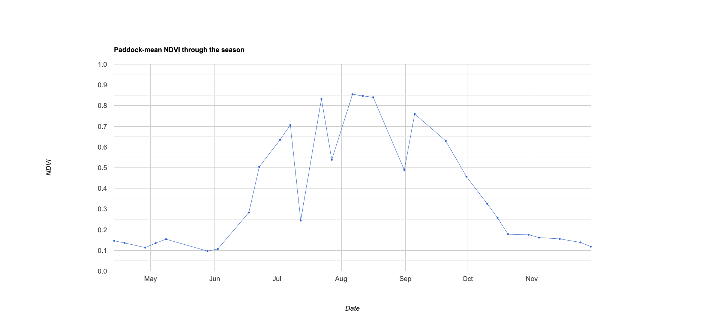

# Remote sensing of vegetation - skills refresher

This lab activity provides a refreseher on Google Earth Engine skills for working with raster and vector data and introduces remote sensing of vegetation concepts over a cropping landscape in Western Australia.

Within season nitrogen (N) applications are typically applied around Zadoks stages 30 to 31 (stem elongation). This is roughly six weeks before peak growing season greenness. How much N to apply and where to apply it requires maps of plant N content. Various studies have suggested that vegetation indices that are sensitive to chlorophyll concentration, such as NDVI or NDRE which capture chlorophyll's aborptance of red light, are correlated with crop N. Such vegetation indices can be an information source for precision agriculture and variable rate technologies. 

<figure markdown="span">
  
  <figcaption>Zadoks growth stages (source: Bayer Crop Science).</figcaption>
</figure>

You will create several vegetation indices for fields during zadoks 30 growth stage and compare them to a reference crop yield dataset for a wheat harvest. 

This lab will cover:

* working with raster and vector data in Google Earth Engine. 
* using the Geometry Tools to digitise features. 
* uploading your own data to use as assets in Google Earth Engine.
* interpreting remote sensing images and vegetation indices. 
* developing independent problem solving skills in Google Earth Engine. 

### Setup

Create a new script in your *labs-gee/lab-7* repository called *vegetation-skills.js*. Enter the following comment header to the script. 

```js
/*
Remote sensing of vegetation - skills 
Author: Test
Date: XX-XX-XXXX

*/

// import data
var assessmentField = ee.Geometry.Point([117.49288619323872, -31.59684932705497]);
Map.addLayer(assessmentField);
Map.centerObject(assessmentField, 14);
Map.setOptions('SATELLITE');
```

**File upload**

Follow the <a href="https://developers.google.com/earth-engine/guides/table_upload#upload-a-shapefile" target="_blank">Google Earth Engine Developer Guide</a> instructions on how to upload a shapefile to your Google Earth Engine account and upload the `bf66-wheat-yield-sampled-2021-geog3301.shp` file which you can download from LMS. Remember that a shapefile comprises multiple files, you will need to upload all of these to Google Earth Engine. 

This file contains a sample of crop yield measurements from a harvester that we will use to compare with vegetation indices. 

Add this dataset to your script by finding it in your **Assets** in the left hand sidebar. Update the variable name to `bf66Yield`. 

**Create an assessment area**

Use the geometry tools to create two different geometry objects:

1. Digitise the field boundary for the field marked by the `assessmentField point`. Give this geometry the name `assessmentFieldPoly`.
2. Use the rectangle drawing tool to create a bounding box covering 20 to 30 fields surrounding the assessment field. Give this geometry the name `assessmentArea`. 

## Vegetation indices

The reference wheat yield data that you have loaded is for a 2021 harvest. Therefore, let's load Sentinel-2 data for the 2021 growing season. 

```js
var SEASON_START = '2021-04-01';   // start of season
var SEASON_END   = '2021-11-30';   // end of season

// S2 ImageCollection
var s2sr = ee.ImageCollection('COPERNICUS/S2_SR_HARMONIZED')
  .filterBounds(assessmentArea)
  .filterDate(SEASON_START, SEASON_END);

// Function to clip images to the assessment area
function clipImg(img) {
    return img.clip(assessmentArea);
}

// Function to mask clouds using the Sentinel-2 QA band
function maskS2clouds(img) {
  var qa = img.select('QA60');

  // Bits 10 and 11 are clouds and cirrus, respectively.
  var cloudBitMask = 1 << 10;
  var cirrusBitMask = 1 << 11;

  // Both flags should be set to zero, indicating clear conditions.
  var mask = qa.bitwiseAnd(cloudBitMask).eq(0)
      .and(qa.bitwiseAnd(cirrusBitMask).eq(0));

  return img.updateMask(mask)
    .divide(10000)
    .copyProperties(img, ['system:time_start']);
}

function addVI(img) {
  img = ee.Image(img);
  var ndvi = img.normalizedDifference(['B8','B4']).rename('NDVI');
  return img.addBands(ndvi)
            .copyProperties(img, ['system:time_start']);
}

var s2 = s2sr.map(maskS2clouds).map(addVI).map(clipImg);
```

<details>
  <summary><b>Can you update the above code to also add a normalised difference red edge (NDRE) index as a band to images in the s2 <code>Image Collection</code>?</b></summary>
  <p>

```js
function addVI(img) {
img = ee.Image(img);
var ndvi = img.normalizedDifference(['B8','B4']).rename('NDVI');
var ndre = img.normalizedDifference(['B8','B5']).rename('NDRE');
return img.addBands(ndvi)
            .addBands(ndre)
            .copyProperties(img, ['system:time_start']);
}
```
  </p>
</details>

The next step is to find the date that corresponds to approximately Zadoks stage 30. The assessmentField has a wheat crop planted in it - this field's crop growth profile can be used as representative of the assessment area. 

Average the NDVI values for all pixels within `assessmentFieldPoly` for each `Image` in the `s2` `ImageCollection`. This returns a time-series of NDVI values. The date of peak NDVI can found by viewing a time-series chart.

```js
// Paddock-mean NDVI time series
function meanNDVI(img) {
  var m = img.select('NDVI').reduceRegion({
    reducer: ee.Reducer.mean(),
    geometry: assessmentFieldPoly,
    scale: 10,
    maxPixels: 1e9
  }).get('NDVI');
  return img.set('meanNDVI', m)
            .set('date', img.date().format('YYYY-MM-dd'));
}

// keep only scenes that actually have data over the paddock
var ts = s2.map(meanNDVI).filter(ee.Filter.notNull(['meanNDVI']));

// time-series chart of paddock-mean NDVI with peak marked
var chart = ui.Chart.feature.byFeature(ts, 'system:time_start', 'meanNDVI')
  .setChartType('LineChart')
  .setOptions({
    title: 'Paddock-mean NDVI through the season',
    hAxis: {title: 'Date', format: 'MMM'},
    vAxis: {title: 'NDVI', viewWindow: {min: 0, max: 1}},
    pointSize: 3, lineWidth: 1, legend: {position: 'none'}
  });
print(chart);
```

The above code snippet should generate the following chart. 

<figure markdown="span">
  
  <figcaption>Mean NDVI for the 2021 growing season for the assessment field.</figcaption>
</figure>

## Growth stage filtering

It looks like the 8<sup>th</sup> August is peak NDVI. The point at which peak NDVI starts to decline is around anthesis / flowering and zadoks stage 30 is roughly 6 weeks earlier (these are crude approximations). The NDVI values seem to drop off around late August so mid-July (approximately six weeks earlier) roughly aligns with zadoks stage 30. 

<details>
  <summary><b>Can you filter s2 <code>Image Collection</code> for all images captured within a week of the 22<sup>nd</sup> July and create a median NDVI and NDRE image? Add the median NDVI and NDRE layers to the map.</b></summary>
  <p>

```js
var zadoks30 = s2
    .filterDate('2021-07-13', '2021-07-27')
    .median();

var ndviVis = {min: 0, max: 1,
  palette: ['#8a6c46','#d9b48a','#c9d17a','#6fae3f','#146b1e']}; 
var ndreVis = {min: 0, max: 1,
  palette: ['ffffff','dadaeb','9e9ac8','6a51a3']}; 

Map.addLayer(zadoks30.select('NDVI'), ndviVis, 'Zadoks 30 NDVI');
Map.addLayer(zadoks30.select('NDRE'), ndreVis, 'Zadoks 30 NDRE');
```
  </p>
</details>

<details>
  <summary><b>Look at the time-series chart. Why is it better to create a zadoks stage 30 <code>Image</code> around the 22<sup>nd</sup> July Sentinel-2 capture than the 12<sup>th</sup> July capture?</b></summary>
  <p>
  The 12<sup>th</sup> July capture looks like a drop out and noisy image. This is likely caused by atmospheric contamination or sensor noise that has remained after atmospheric correction and cloud masking. Patterns in this <code>Image</code> are more likely to be noisy and not related to variability in crop N. 
  </p>
</details>

## Cropland masking

The NDVI and NDRE layers are capturing variability within the fields but they're also picking up variability due to non-agricultural cover such as trees or bare earth. Non vegetated covers such as bare earth have low NDVI values - these pixels can be removed with a *thresholding* operation using logical operators (i.e. `.gt()`, `.gte()`, .`.eq()`). If a pixel's NDVI value is less than 0.2 it's likely to be bare earth and it can be removed from the layer and set to `null`. 

<details>
  <summary><b>What is the difference between the <code>.lt()</code> and <code>.lte()</code> operators?</b></summary>
  <p>
  <code>.lt()</code> - less than
  </p>
  <p>
  <code>.lte()</code> = less than or equals to
  </p>
</details>

The following code snipped finds all pixels with an NDVI value less than 0.2 and then uses this as a mask to set these pixels to have a `null` value. 

```js
var bareEarthMask = zadoks30.select('NDVI').gte(0.2);
zadoks30 = zadoks30.updateMask(bareEarthMask);

Map.addLayer(zadoks30.select('NDVI'), ndviVis, 'Zadoks 30 NDVI - veg only');
Map.addLayer(zadoks30.select('NDRE'), ndreVis, 'Zadoks 30 NDRE - veg only');
```

Toggle the layers on and off to see the effect of thresholding to remove bare earth pixels. 

<details>
  <summary><b>How effective do you think a bare earth / vegetation threshold of 0.2 in NDVI values is?</b></summary>
  <p>
  Moderately effective, if we're being generous. It seems as though a lot of the roads between the fields have not been masked even though they're bare earth covers. Why do you think the roads have an NDVI value greater than 0.2 (think about the Sentinel-2 spatial resolution relative to the size of the target)? Whould you consider using a higher NDVI value as a bare earth / vegetation threshold?
  </p>
</details>

There are also lots of trees scattered between the fields. Let's mask trees as well using the <a href="https://gee-community-catalog.org/projects/meta_trees/" target="_blank">Meta High Resolution 1m Global Canopy Height Map</a>. Load the Meta tree dataset and clip to the assessment area. 

```js
var canopyHt = ee.ImageCollection("projects/sat-io/open-datasets/facebook/meta-canopy-height").mosaic();
var canopy = canopyHt
  .clip(assessmentArea)
  .updateMask(canopyHt.gte(1));

Map.addLayer(canopy, {
    min: 0,
    max: 1,
    palette: ['440154', 'fde725']
}, 'Canopy height (>=1 meter)');
```

<details>
  <summary><b>Can you use the <code>canopy</code> layer to mask out trees from the <code>zadoks30</code> <code>Image</code>? Remember that a mask operation in Google Earth Engine sets all pixels in the target `Image` to null where corresponding pixels in the mask <code>Image</code> are 0.</b></summary>
  <p>
  <code>
  zadoks30 = zadoks30.updateMask(canopyHt.lt(1).clip(assessmentArea));

  Map.addLayer(zadoks30.select('NDVI'), ndviVis, 'Zadoks 30 NDVI - crop only');
  Map.addLayer(zadoks30.select('NDRE'), ndreVis, 'Zadoks 30 NDRE - crop only');
  </code>
  </p>
</details>

<details>
  <summary><b>What alternative strategy could you use to create a mask that leaves only cropland pixels as valid?</b></summary>
  <p>
  Use a land cover map to create a cropland mask (where cropland pixel values equal 1 and non cropland pixels have the value 0). Can you search the Google Earth Engine Data Catalog to find a suitable land cover product? <b>Homework activity</b>: Try using this to make a cropland mask and compare it to the approach used above. 
  </p>
</details>

## Canopy Chlorophyll Content Index 

One challenge with using vegetation indices, such as NDVI, which respond to a range of factors affecting plant growth for precision agriculture is identifying what driver is impacting the crop. If NDVI maps are being created to guide N applications it is important to separate out variability in greenness due to confounding factos such as water availability or low plant cover leading to low vegetation index values. Further, at zadoks 30 stage there is often not complete canopy closure so background soil reflectance can affect normalised vegetation index values.

<a href="https://www.sciencedirect.com/science/article/pii/S0378429010000304" target="_blank">Fitzgerald et al., (2010)</a> demonstrate that the Canopy Chlorophyll Content Index (CCCI) was linearly related with the Canopy Nitrogen Index and could be used to predict N content and N %. 

This CCCI is a 2-dimensional index based on NDVI (which accounts for plant cover) and NDRE (which accounts for plant N status). NDRE values are correlated with NDVI / plant cover, but an increasing NDRE value does not necessarily imply an increase in plant N due to confounding factors. However, at a given NDVI (fixed level of plant cover), the distance of NDRE value between lower and upper limits is an indicator of N status. This index can be interpreted as a relative measure of N at a given level of plant cover or soil backgrounds or NDVI is normalising NDRE for plant cover.

Following <a href="https://www.sciencedirect.com/science/article/pii/S0378429010000304" target="_blank">Fitzgerald et al., (2010)</a>, the CCCI can be computed as:

```js
var ccciMinSlope = 0.34;
var ccciMaxSlope = 0.61;

var ndreMin = zadoks30.select('NDVI').multiply(ccciMinSlope);   // lower NDRE line
var ndreMax = zadoks30.select('NDVI').multiply(ccciMaxSlope);   // upper NDRE line
var ccci = zadoks30.select('NDRE').subtract(ndreMin)
               .divide(ndreMax.subtract(ndreMin)).rename('CCCI');
 
Map.addLayer(ccci, {min: 0, max: 1.5, palette: ['d73027','fee08b','1a9850']},
             'CCCI (cover-normalized N status)');
```

<details>
  <summary><b>What is your interpretation of variability within the assessment field captured using the CCCI versus the NDVI and NDRE layers?</b></summary>
  <p>
  It does not appear to add much signal (potentially more noise) compared to the NDVI and NDRE layers. This might be expected given i) see the next questions, and ii) reported challenges in the literture regarding robustly capturing N variability within a field using a single source of imagery and satellite data (e.g. see <a href="https://link.springer.com/article/10.1007/s11119-023-10102-z" target="_blank">Colaço et al., (2024)</a>, <a href="https://doi.org/10.1016/j.fcr.2021.108205" target="_blank">Colaço et al., (2021)</a>, and <a href="https://doi.org/10.1016/j.atech.2025.101431" target="_blank">Richetti et al., (2025)</a>) . 
  </p>
</details>

<details>
  <summary><b>Fitzgerald et al., (2010) generated the CCCI using narrow-band hyperspectral data and calibrated it against N measurements field trials at a site in Victoria. List two reasons why it is important to be cautious applying the CCCI to Sentinel-2 data over fields in Western Australia for N management.</b></summary>
  <p>

  1) The CCCI was generated and calibrated using ground-based very narrow-band hyperspectral data. These capture conditions differ from Sentinel-2's broader bands and satellite-based captures. Further, the wavelength of the red edge band used by Fitzgerald et al., (2010) differs from Sentinel-2's 705 nm red edge band. This will mean the NDRE used in Fitzgerald et al., (2010) will have different ranges to Sentinel-2 derived NDRE over a Western Australian field. A closer NDRE could be computed from Sentinel-2 data using bands 5 and 7, but these are still slightly different wavebands than used in Fitzgerald et al., (2010).
  </p>
  <p>

  2) The empirical relationship derived in Victoria may not apply in Western Australia due to differences in soil type, climate, crop varieties and growth conditions.

  </p>
</details>

<details>
  <summary><b>What steps do you need to take to assess if Fitzgerald et al., (2010)'s approach could be used for N management in Western Australia?</b></summary>
  <p>
  Collect ground truth reference data of plant N content and N % at zadoks 30 stage and coincident with Sentinel-2 overpasses. This emphasises two important points for working with remote sensing data: first, reference data is required to convert remote sensing images (colour) into metrics that reflect environment systems, and, second, it is vital that any models are appropriately validated before they are used for decision making.  
  </p>
</details>

## Yield data comparison

We don't have any reference data to assess if the NDVI, NDRE or CCCI layers correspond to plant N. However, at the start of the lab crop yield measurements from a harvester was loaded. 

As a final exercise, assess how well correlated the different vegetation index values at zadoks 30 stage are with final crop yield. 

The following code snippet will sample the NDVI value for all points with a crop yield value and compute the correlation coefficient with between NDVI and crop yield.

```js
Map.addLayer(bf66Yield, {}, "Crop Yield Points");

// Extract the NDVI pixel value for each point
var sampledPointsNDVI = zadoks30.select('NDVI').sampleRegions({
  collection: bf66Yield,
  properties: ['DryYield'], // Keep the yield property
  scale: 10,                
  geometries: false          // We don't need to keep the point geometries here
});

// Filter out any points where NDVI is null (e.g., masked non-cropland areas)
// Otherwise, the correlation reducer and chart will throw an error.
var cleanDataNDVI = sampledPointsNDVI.filter(ee.Filter.notNull(['NDVI', 'DryYield']));

var correlation = cleanDataNDVI.reduceColumns({
  reducer: ee.Reducer.pearsonsCorrelation(),
  selectors: ['NDVI', 'DryYield']
});

// The reducer returns an object with 'correlation' and 'p-value'
print('Pearson Correlation Coefficient:', correlation.get('correlation'));
print('P-value:', correlation.get('p-value'));
```

**Homework activities**

1) Compute the correlation coefficients for the NDRE and CCCI layers (hint: use LLMs to help you generate the scatter plots). 

2) Generate scatter plots with vegetation indices on the X-axis and crop yield on the Y-axis.

3) Often, peak NDVI values (max growing season NDVI) are used as a predictor of final yield. Can you generate scatter plots of peak NDVI and crop yield and see if that has a better fit with yield than NDVI at zadoks 30 stage. 

4) **Advanced activity** - the `ccciMinSlope` and `ccciMaxSlope` coefficients were lifted from Fig. 2 in Fitzgerald et al., (2010). Can you generate a scatter plot of NDVI-NDRE and see if these coefficients match the cloud of data over the assessment field? 