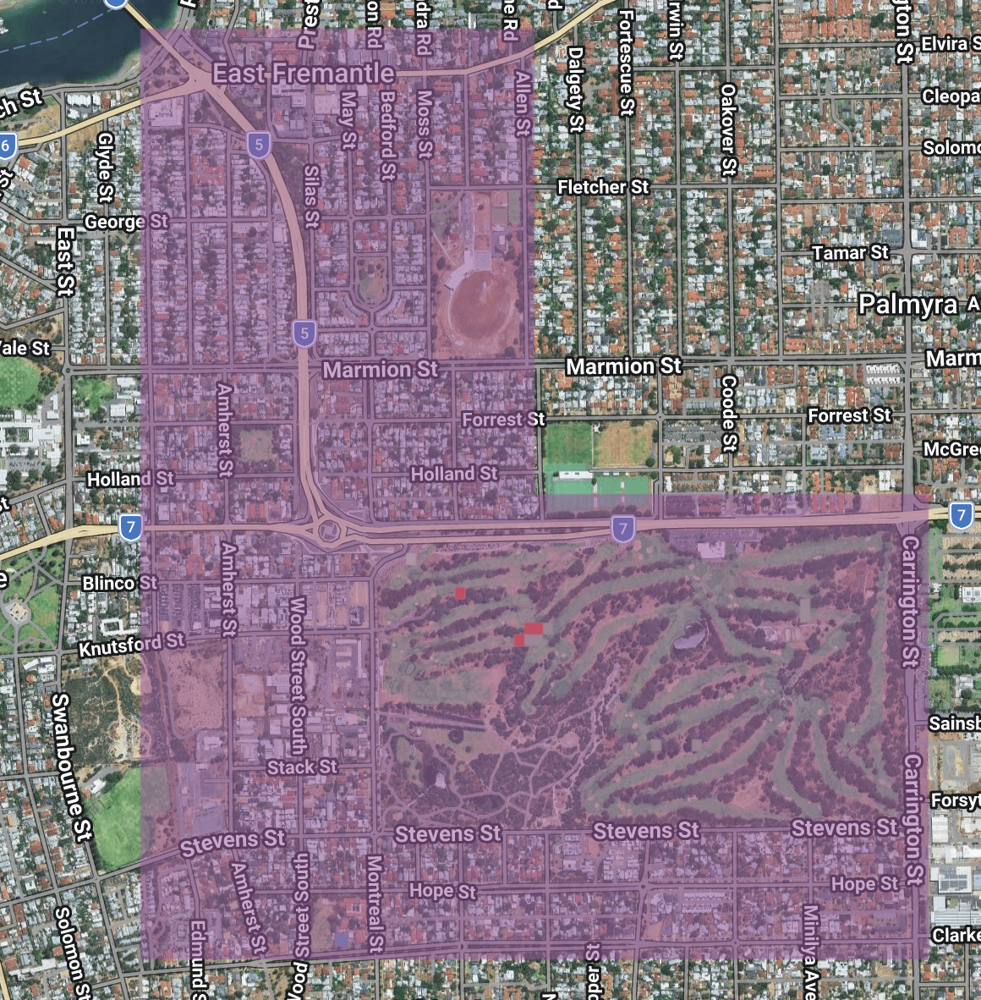

# Drivers of Western Australia's forest loss

This lab will provide an introduction to the <a href="https://developers.google.com/earth-engine/datasets/catalog/UMD_hansen_global_forest_change_2025_v1_13" target="_blank">Global Forest Change</a> dataset. The Global Forest Change dataset is generated using machine learning to map the % tree cover within every Landsat (30 m x 30 m) pixel in 2000 and then detect if a forest loss event occurred in a pixel each year since 2000.

The Global Forest Change dataset will be used to map deforestation across South West Western Australia since 2000. The forest loss dataset will be combined with the World Resources Institute / Google Deep Mind <a href="https://developers.google.com/earth-engine/datasets/catalog/projects_landandcarbon_assets_wri_gdm_drivers_forest_loss_1km_v1_3_2001_2025" target="_blank">Global Drivers of Forest Loss</a> dataset to identify the main deforestation drivers in South West Western Australia. 

Beyond providing an introduction to the Global Forest Change dataset, this lab will:

* demonstrate workflows for spatial analysis problems with remote sensing-derived vegetation datasets.
* develop skills in interpretation of remote sensing-derived vegetation datasets.
* highlight the importance of understanding the limits of remote sensing-derived vegetation datasets and how this can impact interpretation and appropriate use.
* further practice with data visualisation in Google Earth Engine.

### Setup

Create a new script in your *labs-gee/lab-7* repository called *wa-deforestation-drivers.js*. Enter the following comment header to the script. 

```js
/*
WA deforestation drivers 
Author: Test
Date: XX-XX-XXXX

*/

```

Create a geometry covering South West Western Australia as the assessment area for this lab. 

```js
var swWA = ee.Geometry.Polygon(
    [[[114.04865096482823, -29.213491520552775],
        [114.04865096482823, -35.30296834066821],
        [125.78204940232823, -35.30296834066821],
        [125.78204940232823, -29.213491520552775]]]);
Map.centerObject(swWA, 5);
```

Set some constant variables to carry through the script.

```js
var CANOPY_THRESHOLD = 25;    // % canopy cover in 2000 threshold for "forest"
var REDUCTION_SCALE  = 250;   // metres used for AREA reductions - speeds up computation and reduces accuracy
```

## Global Forest Change

Load the Global Forest Change dataset. The Global Forest Change dataset has a band for % tree cover in a Landsat pixel in 2000, a binary band characterising where all forest loss events have occurred, and an integer band representing the year of forest loss (pixel value 1 = loss in 2001, pixel value 2 = loss in 2002 etc.).

```js
// Global Forest Change
var gfc = ee.Image('UMD/hansen/global_forest_change_2025_v1_13').clip(swWA);
 
var treecover2000 = gfc.select('treecover2000');   // % canopy cover in 2000
var lossYear = gfc.select('lossyear');         // 1 = 2001 ... 25 = 2025
var loss = gfc.select('loss');             // 1 = loss during 2001-2025
 
// Classify "forest" in the year 2000 using the chosen canopy-cover threshold
var forest2000 = treecover2000.gte(CANOPY_THRESHOLD);
 
// Forest loss 
var forestLoss = loss.and(forest2000).selfMask();
```

<details>
  <summary><b>Can you visualise the <code>treecover2000</code> and <code>loss</code> layers on the map display?</b></summary>
  <p>

```js
Map.addLayer(treecover2000.updateMask(forest2000),
  {min: CANOPY_THRESHOLD, max: 100, palette: ['c6dfb3', '004c00']},
  'Forest 2000 (>= ' + CANOPY_THRESHOLD + '% canopy)');
Map.addLayer(forestLoss, {palette: ['ff2d00']}, 'Forest loss 2001-2025');
```
</p>
</details>

The following code snippets demonstrate how to compute the total area of forest loss in the assessment area. This is a useful workflow to bookmark as a common geospatial operation is computing the area surface cover features (e.g. forest area, building footprint area, cropland area). An `Image` `areaHa` is created where each pixel's value is its area in ha then pixels where no forest loss occurred are masked - what's left is an `Image` representing the area of forest loss. A `reduceRegion()` operation can then be applied to this image to compute the area of forest loss in hectares.

```js
// Compute the area of forest loss
var areaHa = ee.Image.pixelArea().divide(1e4);     // hectares per pixel
 
var totalLossHa = areaHa.updateMask(forestLoss).reduceRegion({
  reducer:   ee.Reducer.sum(),
  geometry:  swWA,
  scale:     REDUCTION_SCALE,
  maxPixels: 1e13,
  tileScale: 8
});
print('Total forest loss 2001-2025 (ha):', totalLossHa);

```

This code snippet demonstrates how to compute the area of forest loss per year. It starts by creating a two-band `Image` with band 1 being the area of each pixel in hectares and band two being the year of forest loss events. Both are masked to the extent of forest loss over the assessment area. 

A `reduceRegion()` operation is applied to this two band `Image` but note the `.group()` applied the `ee.Reducer.sum()` operation which groups the sum of forest loss area by unique values in the forest loss band. 

The `byYearDict` returned by the reducer operation is dictionary object storing a list of dictionary objects with keys for the year and the area of loss. This needs unpacking and converting to a `FeatureCollection` to pass into charting function.

```js
// Sum the area of forest loss 
var byYearDict = areaHa.addBands(lossYear.updateMask(forestLoss))
  .reduceRegion({
    reducer:   ee.Reducer.sum().group({groupField: 1, groupName: 'lossyear'}),
    geometry:  swWA,
    scale:     REDUCTION_SCALE,
    maxPixels: 1e13,
    tileScale: 8
  });
 
var yearFc = ee.FeatureCollection(
  ee.List(byYearDict.get('groups')).map(function (item) {
    item = ee.Dictionary(item);
    return ee.Feature(null, {
      year:    ee.Number(item.get('lossyear')).add(2000),
      area_ha: item.get('sum')
    });
  })
);
 
print(ui.Chart.feature.byFeature(yearFc, 'year', 'area_ha')
  .setChartType('ColumnChart')
  .setOptions({
    title:  'Annual forest loss in Western Australia (' + CANOPY_THRESHOLD + '% canopy)',
    hAxis:  {title: 'Year', format: '####'},
    vAxis:  {title: 'Area (ha)'},
    legend: {position: 'none'},
    colors: ['d63000']
}));
```

Zoom in on the Wheatbelt and turn on the satellite basemap. Toggle off the forest loss layer on the map display so the tree cover layer is visible.

How well does the Global Forest Change dataset capture tree cover across the broadacre agriculture landscape? 

Try changing the `CANOPY_THRESHOLD` to a lower value - does this improve representation of tree cover in the Wheatbelt?

<details>
  <summary><b>Agriculture is a major driver of global forest loss. Do you think the Global Forest Change will over or under represent forest cover within agricultural landscapes and agricultural-driven forest loss?</b></summary>
  <p>
The Global Forest Change dataset will likely miss isolated trees within agricultural landscapes - it will under represent agricultural tree cover. 

The Global Forest Change dataset will capture agricultural encroachment into existing forests. It is likely to miss agricultural land uses causing loss of fragmented tree cover within already cultivated landscapes. 

It is important to understand the nuances of the Global Forest Change dataset when interpreting estimates of area of tree cover and forest loss. 
</p>
</details>

<details>
  <summary><b>The Global Forest Change dataset defines forest loss as a stand-replacement event - there is a complete loss of forest cover and replacement with different cover within Landsat pixel. What impact could this have on estimates of forest cover and in which landscapes might this bias estimates of forest loss?</b></summary>
  <p>
If a pixel has 10 % forest cover and it is all lost, this registers as a loss event. However, a pixel with 90 % cover than loses 30 % may not register as a loss event despite there being a larger area of loss. 

This could be problematic in smallholder farming landscapes where small-scale agricultural operations encroach on areas of tree cover without completely clearing the existing forest. 
</p>
</details>

## Drivers of forest loss

Next, load the Global Drivers of Forest Loss dataset and map the forest loss drivers across the assessment area.

```js
var drivers = ee.Image(
    'projects/landandcarbon/assets/wri_gdm_drivers_forest_loss_1km/v1_3_2001_2025')
  .clip(swWA);
 
var driverClass = drivers.select('classification');   // integer 1..7
 
var DRIVER_NAMES = [
  'Permanent agriculture', 'Hard commodities', 'Shifting cultivation',
  'Logging', 'Wildfire', 'Settlements & infrastructure',
  'Other natural disturbances'
];
var DRIVER_PALETTE = ['E39D29','E58074','E9D700','51A44E','895128','A354A0','3A209A'];
 
Map.addLayer(driverClass, {min: 1, max: 7, palette: DRIVER_PALETTE},
             'Dominant driver of loss 2001-2025');
             
// Build a legend panel and add to map 
var legend = ui.Panel({
  style: {
    position: 'bottom-left',
    padding: '8px 10px',
    backgroundColor: 'white'
  }
});

// Title
legend.add(ui.Label({
  value: 'Dominant driver of forest loss',
  style: {fontWeight: 'bold', fontSize: '13px', margin: '0 0 6px 0'}
}));

// One row (colour swatch + label) per class
var makeRow = function (color, name) {
  var swatch = ui.Label({
    style: {
      backgroundColor: '#' + color,
      padding: '8px',
      margin: '0 6px 0 0'
    }
  });
  var description = ui.Label({
    value: name,
    style: {margin: '0', fontSize: '12px'}
  });
  return ui.Panel({
    widgets: [swatch, description],
    layout: ui.Panel.Layout.Flow('horizontal')
  });
};

for (var i = 0; i < DRIVER_NAMES.length; i++) {
  legend.add(makeRow(DRIVER_PALETTE[i], DRIVER_NAMES[i]));
}

Map.add(legend);
```

Zoom in on metropolitan Perth and drag the slider on the drivers of forest loss layer so it is semi-transparent. The drivers of forest loss layer is comprised of 1 km x 1 km spatial resolution pixels and it marks large areas of Perth as being affected by Settlement and Infrastructure-driven forest loss. It is important not to interpret these 1 km x 1 km pixels an indicating the extent of forest loss. Looking inside these semi-transparent drivers of loss pixels, the actual area of loss captured by the Global Forest Change dataset are often small and fragmented. 

<figure markdown="span">
  
  <figcaption>Zoom in of drivers of forest loss pixels covering a large area over isolated forest loss events.</figcaption>
</figure>

<details>
  <summary><b>Look at the code snippet to generate the chart of forest loss by year. Can you copy this code snippet and edit to generate a chart showing the area of forest loss by driver? What is the dominant driver of forest loss in South West WA?</b></summary>
  <p>

```js
// Area of forest loss attributed to each dominant driver
var byDriverDict = areaHa.addBands(driverClass.updateMask(forestLoss))
  .reduceRegion({
    reducer:   ee.Reducer.sum().group({groupField: 1, groupName: 'driver'}),
    geometry:  swWA,
    scale:     REDUCTION_SCALE,
    maxPixels: 1e13,
    tileScale: 8
  });
 
var driverFc = ee.FeatureCollection(
  ee.List(byDriverDict.get('groups')).map(function (item) {
    item = ee.Dictionary(item);
    var idx = ee.Number(item.get('driver')).subtract(1);
    return ee.Feature(null, {
      driver:  ee.List(DRIVER_NAMES).get(idx),
      area_ha: item.get('sum')
    });
  })
);
 
print(ui.Chart.feature.byFeature(driverFc, 'driver', 'area_ha')
  .setChartType('ColumnChart')
  .setOptions({
    title:  'Forest loss by dominant driver, Western Australia (2001-2025)',
    hAxis:  {title: 'Driver'},
    vAxis:  {title: 'Area (ha)'},
    legend: {position: 'none'}
  }));

```
</p>
</details>

**Homework activity**

Can you edit this workflow to compute the area of forest loss in the Kimberley region of WA and compare the dominant drivers of forest loss to South West WA?