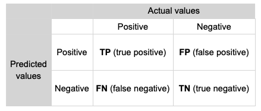
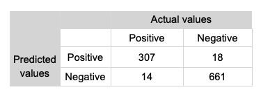
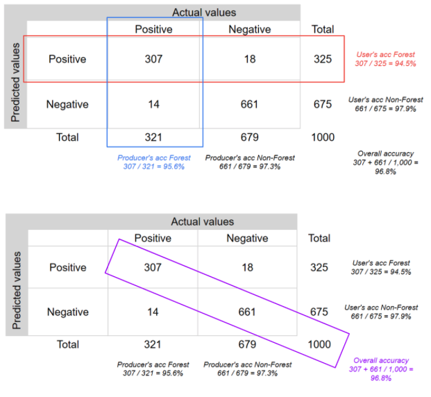

# Accuracy assessment

This lab will demonstrate how to implement a map accuracy assessment. A map accuracy assessment involves comparing classifier predictions to ground truth observations for samples that are independent from the training data (i.e. a **test set**). A range of performance metrics can be computed to quantify the classifier's performance. 

An accuracy assessment is an estimate of a classifier's error when deployed in new locations from the training data. Therefore, the test set should have the following characteristics:

* independence from the training data.
* representative of areas where the classifier will be deployed.
* have sufficient coverage to estimate the classifier's performance in predicting all map classes.

To satify the above criteria, best practice map accuracy assessment suggests using a stratified random sample of points covering the candidate area for prediction, being spatially distinct from the training data, and using map classes as strata. 

A stratified sample is recommended to ensure all map classes, including rare classes, are covered in the test dataset. 

In this lab you will:

* learn how to generate a stratified random sample of points.
* use the *Geometry tools* to label points.
* generate a confusion matrix comparing predicted and ground truth land cover labels.
* compute performance metrics to quantify map accuracy. 

### Setup

Create a new script in your *labs-gee/lab-9* repository called *accuracy-assessment.js*. Enter the following comment header to the script. 

```js
/*
Accuracy assessment
Author: Test
Date: XX-XX-XXXX

*/

```

In this lab you complete an accuracy assessment for the land cover classification of Bangalore from the *supervised classification* lab.

Start by importing the script to generate the Bangalore land cover classification.

```js
// Bangalore boundary
var city = ee.FeatureCollection('projects/spatialthoughts/assets/e2e/bangalore_boundary');
var geometry = city.geometry();
Map.centerObject(city, 12);

// Training data points
var urban = ee.FeatureCollection('projects/spatialthoughts/assets/e2e/urban_gcps');
var bare = ee.FeatureCollection('projects/spatialthoughts/assets/e2e/bare_gcps');
var water = ee.FeatureCollection('projects/spatialthoughts/assets/e2e/water_gcps');
var vegetation = ee.FeatureCollection('projects/spatialthoughts/assets/e2e/vegetation_gcps');

var gcps = urban.merge(bare).merge(water).merge(vegetation);
print(gcps);

// Choose a 4-color palette
// Assign a color for each class in the following order
// Urban, Bare, Water, Vegetation
var palette = ['#cc6d8f', '#ffc107', '#1e88e5', '#004d40' ];
var palette = ee.List(palette);
var landcover = ee.List([0, 1, 2, 3]);

var gcpsStyled = ee.FeatureCollection(
  landcover.map(function(lc){
    var color = palette.get(landcover.indexOf(lc));
    var markerStyle = { color: 'white', pointShape: 'diamond', 
      pointSize: 4, width: 1, fillColor: color};
    return gcps.filter(ee.Filter.eq('landcover', lc))
                .map(function(point){
                  return point.set('style', markerStyle);
                });
      })).flatten();
      
Map.addLayer(gcpsStyled.style({styleProperty:"style"}), {}, 'GCPs');
Map.centerObject(gcpsStyled);

// Function to mask clouds using the Sentinel-2 QA band
function maskS2clouds(img) {
  var qa = img.select('QA60');

  // Bits 10 and 11 are clouds and cirrus, respectively.
  var cloudBitMask = 1 << 10;
  var cirrusBitMask = 1 << 11;

  // Both flags should be set to zero, indicating clear conditions.
  var mask = qa.bitwiseAnd(cloudBitMask).eq(0)
      .and(qa.bitwiseAnd(cirrusBitMask).eq(0));

  return img.updateMask(mask)
    .divide(10000)
    .copyProperties(img, ['system:time_start']);
}

var s2 = ee.ImageCollection('COPERNICUS/S2_SR_HARMONIZED');

var year = 2019;
var startDate = ee.Date.fromYMD(year, 1, 1);
var endDate = startDate.advance(1, 'year');

var filtered = s2
  .filter(ee.Filter.lt('CLOUDY_PIXEL_PERCENTAGE', 30))
  .filter(ee.Filter.date(startDate, endDate))
  .filter(ee.Filter.bounds(geometry))
  .map(maskS2clouds);

var composite = filtered.median();

// Display the input composite.
var rgbVis = {
  min: 0.0,
  max: 0.3,
  bands: ['B4', 'B3', 'B2'],
};
Map.addLayer(composite.clip(geometry), rgbVis, 'image');

// Select bands used for training
var bands = ['B2', 'B3', 'B4', 'B5', 'B6', 'B7', 'B8', 'B8A', 'B11', 'B12'];
composite = composite.select(bands);

// Overlay the point on the image to get training data.
var training = composite.sampleRegions({
  collection: gcps, 
  properties: ['landcover'], 
  scale: 10
});
print('Training data:', training);

// Train a classifier.
var classifier = ee.Classifier.smileRandomForest(50).train({
  features: training,  
  classProperty: 'landcover', 
  inputProperties: composite.bandNames()
});

// Classify the image.
var classified = composite.classify(classifier);

// Choose a 4-color palette
// Assign a color for each class in the following order
// Urban, Bare, Water, Vegetation
var palette = ['#cc6d8f', '#ffc107', '#1e88e5', '#004d40' ];

Map.addLayer(classified.clip(geometry), {min: 0, max: 3, palette: palette}, 'Classification');

//////////////////////////////////////////////////////////////////////////////////

// Accuracy assessment begins here
```

To speed up the process of labelling test points, we will focus our accuracy assessment on a small area of Bangalore.

```js
var testArea = ee.Geometry.Polygon(
        [[[77.5612088526073, 13.113732437982822],
          [77.5612088526073, 13.06959171420989],
          [77.63056004889636, 13.06959171420989],
          [77.63056004889636, 13.113732437982822]]]);
Map.centerObject(testArea);
```

## Sample test points

The following code snippet will generate a stratified sample of 10 points per land cover class within the extent of the `testArea` `Geometry`. Look at the code comments to understand what arguments are set in the `stratifiedSample()` function. 
```js
var stratifiedPoints = classified.stratifiedSample({
  numPoints: 0,           // Base points per class (0 if specifying exactly via classPoints)
  classBand: 'classification', // The band containing the discrete integer classes
  region: testArea,            // Area to sample within
  scale: 10,              // Native resolution of the image (10m for S2)
  classValues: [0, 1, 2, 3], // Map classes
  classPoints: [10, 10, 10, 10], // Exact number of points requested for each respective class
  geometries: true,       // CRITICAL: Set to true to output actual Point geometries
  seed: 42,               // Optional: Random seed for reproducibility
  dropNulls: true         // Optional: Drops points that fall on masked/null pixels
});
print('Test points:', stratifiedPoints);

Map.addLayer(stratifiedPoints, {color: 'red', pointSize: 10}, 'Test points');
```

## Label test points

Now that we have a set of test set points, we need to label them. You will need to do this using the *Map* *Geometry tools*. 

1. Create four new `FeatureCollection`s called `urbanTest`, `bareTest`, `waterTest` and `vegetationTest`. Create each new `FeatureCollection` by clicking on **+ new layer** under *Geometry Imports*. **Note: in the video below these layers are erroneously named `urban`, `bare`, `water`, and `vegetation`.**
2. Click on the *gear* icon to bring up the settings for each new layer that you create and:
    * set the type to `FeatureCollection`
    * add a `landcover` property with the value 0 for urban, 1 for bare, 2 for water and 3 for vegetation
3. Make sure all the layers are locked (the padlock symbol under the *Geometry Imports* is clicked).
4. Zoom in on the *Map* display to the extent of `testArea` where you should see red dots marking the test point locations. 
5. Turn off all the map layers and turn on the satellite basemap.
6. Zoom in until you can clearly see the test points and their underlying land cover. 
7. Pick a test point and visually identify its landcover. Unlock that land cover class `Geometry` layer (e.g. `urbanTest` for urban) and click on the point marker and then click on the map on the red dot. Make sure you lock the `Geometry` layer again. 
8. Keep doing this until you have labelled all test points. Note, your label should correspond to what you can see on the satellite basemap and not necessarily the name of the layer. 

The below video demonstrates this process:

<iframe title="vimeo-player" src="https://player.vimeo.com/video/1228302655?h=a7ffd75616" width="640" height="360" frameborder="0" referrerpolicy="strict-origin-when-cross-origin" allow="autoplay; fullscreen; picture-in-picture; clipboard-write; encrypted-media; web-share"   allowfullscreen></iframe>

**Make sure you save your script to avoid losing your labels.**

Merge each of the `urbanTest`, `bareTest`, `waterTest` and `vegetationTest` `FeatureCollection`s into one `testSet` `FeatureCollection`.

```js
var testSet = urbanTest.merge(bareTest).merge(waterTest).merge(vegetationTest);
```

The `testSet` `FeatureCollection` now stores ground truth land cover labels for each point. Next, we need to attach the map predicted land cover classes.

```js
var testSet = classified.sampleRegions({
  collection: testSet,
  scale: 10
});
print('Test set:', testSet);
```

**Make sure you save your script to avoid losing your labels.**

## Confusion matrix

Next, we can compute a confusion matrix to compare the predicted classes to the ground truth classes. A confusion matrix places predicted classes along one axis and ground truth classes on the other. The top left to bottom right diagonal through the matrix represents the number of correct predictions per class. From the confusion matrix you can read off true positives, false positives, true negatives and false negatives:

* TP: classified as positive and the actual class is positive
* FP: classified as positive and the actual class is negative
* FN: classified as negative and the actual class is positive
* TN: classified as negative and the actual class is negative

<figure markdown="span">
  
  <figcaption>Confusion matrix (Source: Nicolau et al., (2023) - Earth Engine Fundamentals and Applications).</figcaption>
</figure>

<figure markdown="span">
  
  <figcaption>Hypothetical confusion matrix (Source: Nicolau et al., (2023) - Earth Engine Fundamentals and Applications).</figcaption>
</figure>

A range of performance metrics can be computed from the confusion matrix.

The overall accuracy is the percentage of the points in the test set that the classifier correctly predicted:

$$Accuracy = \frac{TP + TN}{Sample\:size}$$

In the above confusion matrix the overall accuracy is 96.8% - (307 + 661) / 1000.

The producer's accuracy (or recall) is the number of points in a test set of the target class that were correctly predicted. It is a measure of omission error. 

$$Producers\:accuracy = \frac{TP}{(TP + FN)}$$

The user's accuracy (or precision) computes of all the test points predicted as the target class, how many actually were from the target class. It is a measure of commission error. 

$$Users\:accuracy = \frac{TP}{(TP + FP)}$$

Omission error is $100\% - Producer\:accuracy$ and commission error is $100\% - Users\:accuracy$. 

<figure markdown="span">
  
  <figcaption>User's and producer's accuracy (Source: Nicolau et al., (2023) - Earth Engine Fundamentals and Applications).</figcaption>
</figure>

Let's compute a confusion matrix:

```js
var confusionMatrix = testSet
    .errorMatrix({
        actual: 'landcover',
        predicted: 'classification'
    });
```

Once the confusion matrix has been computed, we can generate performance metrics:

```js
print('Confusion matrix:', confusionMatrix);
print('Overall Accuracy:', confusionMatrix.accuracy());
print('Producers Accuracy:', confusionMatrix.producersAccuracy());
print('Consumers Accuracy:', confusionMatrix.consumersAccuracy());
```

!!! note
    In Google Earth Engine the user's accuracy is called consumers accuracy.

## Interpretation

**What is your assessment of the map's accuracy?** 

**Which land cover classes perform well?**

<a href="https://doi.org/10.1016/j.rse.2019.05.018" target="_blank">Stehman and Foody (2019)</a> set out best practice map accuracy assessment. Use this paper to help you consider your answer to the following question:

<details>
  <summary><b>How could this accuracy assessment procedure be improved?</b></summary>
<p>
10 test points per class is quite a low number. There are equations that can be used to estimate sample sizes and the number of samples to allocate to each strata (see <a href="https://doi.org/10.1016/j.rse.2019.05.018" target="_blank">Stehman and Foody (2019) - section 2.5</a> for a discussion).
</p>

<p>Weight each strata by the area of the map that it covers so the performance metrics are representative of the map's accuracy and are not overly influenced by rare classes.</p>

<p>
Confidence intervals / standard errors could be computed to provide an indication of uncertainty in the estimates of the performance metrics.
</p>
</details>

**Homework activity**

Review <a href="https://docs.google.com/document/d/1UCB900oCdJERca-2WUeDlCu52MjPKJxETJ_jJcLM0bM/edit?tab=t.0#heading=h.qddld13wsqk3" target="_blank">Chapter 2.1 of Nicolau et al., (2023)</a> to see how they use the *Geometry tools* to generate training data points. Can you adapt this workflow to generate a classifier to predict the extent of mangroves using Sentinel-2 data over Mangrove Bay, Cape Range National Park? 

Look at how <a href="https://docs.google.com/document/d/1UCB900oCdJERca-2WUeDlCu52MjPKJxETJ_jJcLM0bM/edit?tab=t.0#heading=h.qddld13wsqk3" target="_blank">Chapter 2.1 of Nicolau et al., (2023)</a> develop an unsupervised classification. Can you create an unsupervised classification of Sentinel-2 data over Mangrove Bay, Cape Range National Park? Does a supervised or unsupervised classification provide a better segmentation of the mangrove extent?