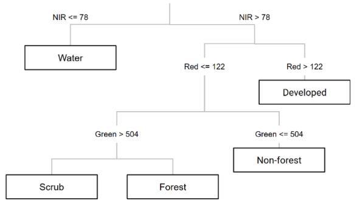
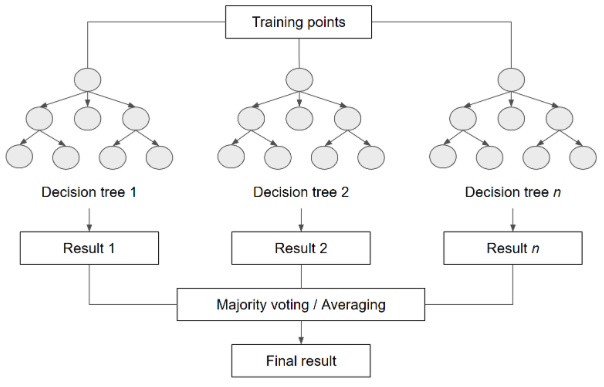

# Supervised classification

This lab demonstrates how to implement supervised classification in Google Earth Engine. In remote sensing, image classification is the process of converting spectral reflectance values, spectral indices and possibly temporal reflectance profiles into a categorical label. Land use and land cover classification is a common remote sensing image classification task - a classifier converts bands in an image into pixel-wise labels describing the land cover or use at a location. 

!!! note "Quick Aside - land cover versus land use"
    Land cover describes what is physically on the surface (e.g. tree cover, cereal crops, buildings). Land use describes how the land is being used by people (e.g. orchards, agriculture, residential).

Supervised learning involves training a classifier (or model) to learn rules that map input values to an output class label. For land cover and land use classification this is training the classifier to learn rules that map spectral reflectance input values to a land cover or use class label. To train the classifier we need a training dataset. A **training dataset** comprises samples with observations for both the target label and input predictor values. The classifier learns rules from the labelled samples so that its predictions of target land cover / use classes match the observed labels. 

The classifier learns rules from the labelled samples so that its predictions match the observed labels.

<figure markdown="span">
  
  <figcaption>An ML model updating its predictions for each labeled example in the training dataset. Here, the blue columns would represent spectral reflectance values in a pixel and the yellow column would represent a ground truth land cover or use class label (Source: Google Machine Learning Crash Course).</figcaption>
</figure>

<figure markdown="span">
  
  <figcaption>This is an illustration of a hypothetical trained decision tree classifier for a land cover mapping task. Here, the classifier has learnt if / else rules applied to spectral reflectance values to predict a location's land cover (Source: Nicolau et al., (2023) - Earth Engine Fundamentals and Applications).</figcaption>
</figure>


Once the classifier is trained you can use it to make predictions for samples with a ground truth label that were **not** part of the training dataset - this is the **test set**. Accuracy assessment involves comparing predictions to ground truth labels for the test set. This provides an indication of how well the classifier has learnt rules mapping input predictors to target class labels and what the accuracy of predictions would be if you use the classifier in new locations. 

In this lab you train a classifier to predict land cover across the extent of Bangalore, India, and you will:

* learn how to prepare training datasets.
* learn how to train a supervised classifier for land cover classification.
* generate a land cover map using a trained classifier.

This lab is adapted from <a href="https://courses.spatialthoughts.com/end-to-end-gee.html#introduction" target="_blank">Gandhi, (2021)</a> and <a href="https://docs.google.com/document/d/1UCB900oCdJERca-2WUeDlCu52MjPKJxETJ_jJcLM0bM/edit?tab=t.0" target="_blank">Nicolau et al., (2023)</a>.

### Setup

Create a new script in your *labs-gee/lab-9* repository called *supervised-classification.js*. Enter the following comment header to the script. 

```js
/*
Supervised classification
Author: Test
Date: XX-XX-XXXX

*/

```

This lab focuses on developing a land cover classification for the city of Bangalore, India. Let's start by loading the study extent.

```js
var city = ee.FeatureCollection('projects/spatialthoughts/assets/e2e/bangalore_boundary');
var geometry = city.geometry();
Map.centerObject(city, 12);
```

Next, let's load the ground truth data. These are points that have been labelled with the land cover at that location. They're called ground truth as they're meant to represent what is actually on the ground.

There are separate `FeatureCollection`s of points for urban, bare, water and vegetation classes. Merge them into one `FeatureCollection`. 

```js
var urban = ee.FeatureCollection('projects/spatialthoughts/assets/e2e/urban_gcps');
var bare = ee.FeatureCollection('projects/spatialthoughts/assets/e2e/bare_gcps');
var water = ee.FeatureCollection('projects/spatialthoughts/assets/e2e/water_gcps');
var vegetation = ee.FeatureCollection('projects/spatialthoughts/assets/e2e/vegetation_gcps');

var gcps = urban.merge(bare).merge(water).merge(vegetation);
print(gcps);
```

The merged `FeatureCollection` has been printed to the *console* on the right side panel. **What properties does each point have?**

The following code will visualise the ground truth points on the map with a different colour for each class. 

```js
// Choose a 4-color palette
// Assign a color for each class in the following order
// Urban, Bare, Water, Vegetation
var palette = ['#cc6d8f', '#ffc107', '#1e88e5', '#004d40' ];

// Display the GCPs
// We use the style() function to style the GCPs
var palette = ee.List(palette);
var landcover = ee.List([0, 1, 2, 3]);

var gcpsStyled = ee.FeatureCollection(
  landcover.map(function(lc){
    var color = palette.get(landcover.indexOf(lc));
    var markerStyle = { color: 'white', pointShape: 'diamond', 
      pointSize: 4, width: 1, fillColor: color};
    return gcps.filter(ee.Filter.eq('landcover', lc))
                .map(function(point){
                  return point.set('style', markerStyle);
                });
      })).flatten();
      
Map.addLayer(gcpsStyled.style({styleProperty:"style"}), {}, 'GCPs');
Map.centerObject(gcpsStyled);
```

## Training data

Here, we will generate training data from a median 2019 Sentinel-2 composite image. This image stores the median per-band reflectance value across all cloud free retrievals across 2019. 

```js
// Function to mask clouds using the Sentinel-2 QA band
function maskS2clouds(img) {
  var qa = img.select('QA60');

  // Bits 10 and 11 are clouds and cirrus, respectively.
  var cloudBitMask = 1 << 10;
  var cirrusBitMask = 1 << 11;

  // Both flags should be set to zero, indicating clear conditions.
  var mask = qa.bitwiseAnd(cloudBitMask).eq(0)
      .and(qa.bitwiseAnd(cirrusBitMask).eq(0));

  return img.updateMask(mask)
    .divide(10000)
    .copyProperties(img, ['system:time_start']);
}

var s2 = ee.ImageCollection('COPERNICUS/S2_SR_HARMONIZED');

var year = 2019;
var startDate = ee.Date.fromYMD(year, 1, 1);
var endDate = startDate.advance(1, 'year');

// Edit this block to map the cloud mask function
var filtered = s2
  .filter(ee.Filter.lt('CLOUDY_PIXEL_PERCENTAGE', 30))
  .filter(ee.Filter.date(startDate, endDate))
  .filter(ee.Filter.bounds(geometry));

var composite = filtered.median();

// Display the input composite.
var rgbVis = {
  min: 0.0,
  max: 0.3,
  bands: ['B4', 'B3', 'B2'],
};
Map.addLayer(composite.clip(geometry), rgbVis, 'image');
```

**In the above code snippet `maskS2clouds` is not mapped over the collection of Sentinel-2 `Image`s to remove cloudy pixels and rescale the surface reflectance data to limits of 0 and 1. Can you `map()` `maskS2clouds` over the `s2` `ImageCollection` before computing the median composite `Image`?**

!!! note
  If you do not apply `maskS2clouds` the `composite` `Image` will not render any variation on the map display as the `rgbViz` visualisation parameters are set up for scaled Sentinel-2 reflectance values. 

The `FeatureCollection` `gcps` stores the land cover label for each point. It does not contain spectral reflectance values at each point (i.e. the input predictors). To train a classifier we need to attach the spectral reflectance values. To do this we can `sample` the `composite` `Image` at the point locations. The following code snippet does this.

```js
// Select bands used for training
var bands = ['B2', 'B3', 'B4', 'B5', 'B6', 'B7', 'B8', 'B8A', 'B11', 'B12'];
composite = composite.select(bands);

// Sample reflectance values at point locations over the image to get training data.
var training = composite.sampleRegions({
  collection: gcps, 
  properties: ['landcover'], 
  scale: 10
});
print('Training data:', training);
```

You can check the `training` dataset in the *console* and each point should have a `landcover` property and properties for spectral reflectance values. 

## classifier training

Now we have a training dataset, we can use it to train a classifier. Here, we will train a random forest classifier. A random forests model comprises a series of decision tree classifiers and the final prediction is the majority prediction for a location across all trees. 

Follow this <a href="https://developers.google.com/machine-learning/decision-forests/random-forests" target="_blank">link</a> for an explainer on random forests models. 

<figure markdown="span">
  
  <figcaption>Random forests classifier (Source: Nicolau et al., (2023) - Earth Engine Fundamentals and Applications).</figcaption>
</figure>

The following code snippet demonstrates how to train the classifier. Note, we pass in the `training` set to the `features` argument, set the `classProperty` to the `landcover` property, and set the `inputProperties` (i.e. the predictor variables) to the `Image` band names. Executing this code trains the classifier to relate input band values to land cover labels. 

```js
// Train a classifier.
var classifier = ee.Classifier.smileRandomForest(50).train({
  features: training,  
  classProperty: 'landcover', 
  inputProperties: composite.bandNames()
});
```

## Deployment

Once the classifier is trained, it can be used to generate predictions for pixels not included in the training set and to produce a land cover map. The following code snippet applies the classifier to all pixels in the `composite` `Image`. It returns an `Image` where each pixel value corresponds to a predicted land cover class. 

```js
// Classify the image.
var classified = composite.classify(classifier);
```

We can visualise the land cover map.

```js
// Choose a 4-color palette
// Assign a color for each class in the following order
// Urban, Bare, Water, Vegetation
var palette = ['#cc6d8f', '#ffc107', '#1e88e5', '#004d40' ];

Map.addLayer(classified.clip(geometry), {min: 0, max: 3, palette: palette}, 'Classification');
```

## Feature engineering

Feature engineering is the process of preparing input variables that can improve the classifier performance. Spectral indices can be used to highlight certain land surface features (e.g. vegetation indices capture information about vegetation condition).

**Can you compute NDVI and normalised difference built up (NDBI) indices for the `composite` `Image` and retrain the classifier? You will need to append the NDVI and NDBI bands to the `composite` `Image` and then re-sample the `Image` to generate the training data. Visually inspecting this classified map, does this improve classifier performance?**

## Next steps

Turn on the satellite basemap and zoom in and pan around and visually inspect the land cover map. 

<details>
  <summary><b>What is your qualitative assessment of the map's accuracy? What things could you consider to improve the classifier's performance?</b></summary>
<p>

There are only 33 data points in the training dataset. You could consider increasing the number of training data points to ensure the training dataset represents all conditions the classifier might encounter when deployed over wider areas. You could focus on collecting more training points for classes that perform poorly. 

You could also consider how appropriate the map classes are. Is your classifier able to separate classes based on their spectral reflectance values - do you need to aggregate classes? Or, is one class masking a lot of different land covers and could you separate it into two or more classes (e.g. split vegetation into grass and tree cover)?
</p>
</details>

Before using a land cover classification, an accuracy assessment needs to be performed. Head to the next lab to see how to implement a map accuracy assessment. 